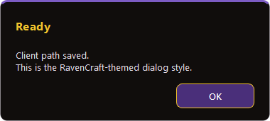

# IchaLaunch

[](https://github.com/brutaliccus/IchaLaunch/releases/latest)
[](https://buymeacoffee.com/jeb32411u)

> **Fresh install:** Use the launcher's **INSTALL** flow for a clean RavenCraft setup. Do **not** point IchaLaunch at an old TurtleWoW or Capybara client — start fresh for the best results.

**IchaLaunch v1.2.1** installs **[RavenCraft](https://ravencraft.io/)** (Turtle WoW–compatible 1.18), manages addons and client mods, and launches the game.

Download **`IchaLaunch.exe`** from **[Releases](https://github.com/brutaliccus/IchaLaunch/releases/latest)**.

A frameless RavenCraft-themed window: **HOME**, **ADDONS**, **CLIENT**, **SETTINGS**, and a **PLAY** bar.

---

## What's new in v1.2.0

- **Linux from source** — on Linux, **PLAY** can launch the client through **umu-launcher** / Proton (optional paths in Settings). The Windows EXE is still Windows-only.
- **Case-insensitive client paths** — `WoW.exe` / `Wow.exe` and related files resolve correctly on case-sensitive disks.
- **Realmlist backup** — an existing `realmlist.wtf` is kept as `.bak` instead of being overwritten blindly.
- **Self-update** — launcher self-update is offered on Windows only (no-op elsewhere).
- **PLAY / UPDATE split** — a square update control sits left of **PLAY** (CheckButtonGlow pulse). **PLAY** stays right-aligned and is not blocked by a pending launcher update.
- **Glue-panel buttons** — **PLAY**, **REGISTER HERE**, and the update plate use taller purple WoW glue-panel art; hover uses the Down plate (no gold box).
- **Addons options cog** — repository settings uses the WoW `UI-OptionsButton` art.
- **Vanilla Tweaks detect** — on-disk Vanilla Tweaks is detected more reliably so disable/remove can run.

---

## What's new in v1.1.1

- **SuperWoW troubleshooting** — detects broken or leftover SuperWoW installs (corrupt `SuperWoWhook.dll`, stale SuperAPI addon, `dlls.txt` drift) and shows a guided fix dialog after failed install/remove/sync or when you open **CLIENT** with drift on disk.
- **SuperWoW install hardening** — PE verification after DLL install, automatic rollback from `.ichalaunch/backups/` on failure, mirrored `.ichalaunch/dlls.txt` cleanup, stricter addon removal errors.
- **DLL mod security hint** — first time you enable a DLL-injecting client mod (SuperWoW, Nampower, VanillaHelpers, etc.), a scrollable dialog explains how to add your game folder to Windows Security exclusions (optional “Don’t show again”).

---

## What's new in v1.1.0

- **Addon update checks without a token** — scans use git ref discovery (and an optional catalog tip index) so **Check for updates** no longer asks for a personal access token. A token stays optional for fork/version browsing.
- **Addon install picker** — catalog **Install** opens fork + version pickers with a live **README preview** before files land on disk.
- **Archived forks** — fork lists include archived repos (sorted after active forks) so older Turtle forks stay discoverable.
- **Fork dropdown safety** — install picker fork/version combos stay disabled until the GitHub browse fetch finishes (no half-populated lists).
- **VanillaFixes / DXVK** — mutual exclusivity in the client mod planner; terminal logs spell out launch mode (`VanillaFixes.exe` vs direct `WoW.exe`) and on-disk VF state.
- **PLAY pre-launch mod sync** — **PLAY** installs missing enabled mods and removes disabled ones before launch (full desired-state sync, not just `dlls.txt` tweaks).
- **Reforged HD Patch L/T** — variant tracking with mutual exclusivity (only one HD patch letter at a time).
- **Settings reliability** — atomic settings writes with `.tmp` + backup recovery; saved game/addons paths are preserved across load/save cycles; auto-scan cooldown slider snaps and persists correctly.
- **Dialog layering** — themed dialogs no longer use stay-on-top, so prompts do not steal clicks from the game.
- **Client tab** — mod cards show **author/contributor** labels; **Check Game Permissions** scans and can repair ACL/read-only issues under your game folder.
- **Launcher self-update** — release metadata cache hardened for smoother in-app **UPDATE** checks.

---

## Get the launcher

1. Open the latest release: [github.com/brutaliccus/IchaLaunch/releases/latest](https://github.com/brutaliccus/IchaLaunch/releases/latest)
2. Download **`IchaLaunch.exe`** (v1.2.1)
3. Put it somewhere convenient (next to your game folder is fine — not required)
4. Run the EXE

No installer. Windows may show a SmartScreen prompt for an unsigned download — **More info** → **Run anyway** if you trust the release.

## Platform support

IchaLaunch ships as a **native Windows** executable for **Windows 10 or 11** (64-bit).

**Linux from source** is supported: run the Python app and point Settings at **umu-launcher** / Proton to launch the Windows client. Running **`IchaLaunch.exe` under Proton/Wine is not supported** and often fails with missing DLL errors (`icuuc.dll`, `Qt6Core.dll`).

---

## Install the RavenCraft client


If you already have a 1.18 client, skip INSTALL and point **SETTINGS** at the folder that contains `WoW.exe`.

Otherwise tap **INSTALL** on the bottom bar:

1. Pick a parent folder (prefer something simple like `D:\Games` — avoid Program Files, Desktop, Downloads, and Documents)
2. Your browser opens **Gofile** — download **`twmoa_1181.zip`** (a VPN may be required)
3. Leave IchaLaunch open. It watches **Downloads**, extracts into a **`RavenCraft`** folder, writes `realmlist.wtf`, then deletes the zip
4. **PLAY** appears when the client is ready

To unlink and install again, use **Reset Client Link** in **SETTINGS**.

---

## Play

**PLAY** runs pre-launch checks, **syncs client mods** to match your enabled list (install missing / remove disabled), then launches World of Warcraft.

When VanillaFixes is installed and enabled in Settings, the launcher prefers `VanillaFixes.exe` and logs the chosen launch path in the terminal. VanillaFixes and **VanillaFixes + DXVK** cannot both be enabled — pick one stack in **CLIENT**.

---

## Addons


- Browse the Turtle WoW wiki **catalog**, search, and filter
- **Install** from the catalog opens the **install picker** (fork, version, README preview)
- **Add from GitHub** — paste any public addon repo with the same preview flow
- **Settings** on an installed addon — change fork/version when a GitHub token is saved
- **Update** / **Update All** when a newer version is available
- Uncheck an addon to **unload** it (stays on disk; the game won't load it)

### GitHub token & addon scans

**Check for updates** does not need a token. IchaLaunch reads each addon's latest commit from GitHub's git interface (and a shared catalog tip-SHA file when available), which is not the 60-request REST API budget. Client mod update checks (VanillaFixes, SuperWoW, HD patches, etc.) use the same index for release tags when the mod source is on GitHub.

A token in **SETTINGS → GitHub API** is still optional and unlocks fork/version browsing plus README previews in the install picker. REST is only a fallback if git/Atom fail; that fallback is still paced at 60 requests/hour without a token.

The tip index is rebuilt hourly on GitHub (addons + client mods). Launchers refresh their cached copy about once per hour when checking for updates.

To rebuild the bundled catalog tip index locally: ``python tools/build_addon_tips.py`` (``--limit 20`` for a short test run).


---

## Client mods


The **CLIENT** tab covers engine and visual packs — VanillaFixes, DXVK, SuperWoW, Nampower, UnitXP, Reforged HD Patch variants, night sky, and similar.

- Tick what you want, then **Apply Changes** (or let **PLAY** sync on launch)
- Search across categories; **Open in Git** when a repo link exists
- **Author** labels on mod cards
- **DXVK GPU check** warns when Vulkan may be a poor match
- **HD Patch L / T** — only one letter variant enabled at a time

---

## Settings


- **Game location** — folder that contains `WoW.exe`, plus **Verify**
- **AddOns folder** — defaults to `Interface\AddOns` under the game; override if needed
- **Launch** — VanillaFixes preference, minimize or close the launcher when the game starts
- **Automatically Check For Updates On Startup** — launcher, addons, and client mods
- **Auto-scan cooldown** — 15 min–24 h (default 1 h); manual checks always run
- **GitHub API** — optional personal access token (fine-grained read-only recommended; not required for addon update badges)
- **Check Game Permissions** — scan/repair read-only files and deny ACEs under the game tree
- **Reset Client Link** — unlink the saved WoW folder so **PLAY** becomes **INSTALL** again

Settings are written **atomically** (`.tmp` swap + backup) so a crash mid-save does not wipe your paths.

### GitHub personal access token

Optional — only needed for live fork/version lists and README previews. Update notifications work without one.

1. Open [GitHub → Settings → Developer settings → Personal access tokens](https://github.com/settings/tokens)
2. Create a token:
   - **Fine-grained (recommended):** resource owner = your user; repository access = **Public repositories**; permissions = **Contents: Read-only** and **Metadata: Read-only**
   - **Classic:** `public_repo` works for API reads but also grants write access to public repos — prefer fine-grained read-only.
3. Paste in **SETTINGS → GitHub API** and save

The token stays on your PC and is sent only as `Authorization` to GitHub hosts (`api.github.com`, `github.com`, `*.githubusercontent.com`).

---

## Progress and launcher updates


Downloads, extracts, and update checks show a **determinate** bar on the bottom strip.

When a newer IchaLaunch is on GitHub Releases, **PLAY** becomes **UPDATE** and replaces the EXE in place.

---

## UI dialogs



Frameless themed prompts (token entry, install picker, confirmations) use normal window stacking — they do **not** stay on top of the game window.

---

## Troubleshooting

**Launcher won't start / `ImportError: DLL load failed` / missing `icuuc.dll` or `Qt6Core.dll`**  
Run **`IchaLaunch.exe` natively on Windows 10/11** — not under Proton/Wine. Install the latest **[Microsoft Visual C++ Redistributable (x64)](https://learn.microsoft.com/en-us/cpp/windows/latest-supported-vc-redist)** if needed.

**Windows Defender / Controlled Folder Access blocks VanillaFixes or DLL mods**  
Allow `IchaLaunch.exe`, `VanillaFixes.exe`, and `WoW.exe`, or move the game out of a protected folder. Use **Check Game Permissions** in Settings.

### SuperWoW install issues / Windows Security

This usually means Windows Security blocked or damaged `SuperWoWhook.dll` during install, or the **SuperAPI** companion addon was left behind when turning the mod off.

**Fix:**

1. Add your **entire WoW folder** as a Windows Security exclusion (Settings → Privacy & security → Windows Security → Virus & threat protection → Manage settings → Exclusions → Add an exclusion → Folder).
2. In IchaLaunch **CLIENT** tab: turn **SuperWoW** off, click **Apply**, then turn it on again and **Apply** (or reinstall manually from [SuperWoW releases](https://github.com/balakethelock/SuperWoW/releases)).
3. When SuperWoW is disabled, confirm these are gone:
   - `SuperWoWhook.dll` in the WoW folder
   - `Interface\AddOns\SuperAPI`
   - `SuperWoWhook.dll` lines in `dlls.txt` and `.ichalaunch\dlls.txt` (if present)
4. If problems persist, move the game out of Downloads/Desktop (e.g. `C:\Games\YourServer`) and use **Check Game Permissions** in Settings.

IchaLaunch may show a troubleshooting dialog when it detects this drift or after a failed SuperWoW install/remove.

**Manual SuperWoW install** is fine: place `SuperWoWhook.dll` from the [official release zip](https://github.com/balakethelock/SuperWoW/releases) in your WoW folder, install the [SuperAPI](https://github.com/balakethelock/SuperAPI) addon, and ensure `SuperWoWhook.dll` is listed in `dlls.txt` (Turtle-style clients). You do not need `SuperWoWlauncher.exe` when using `dlls.txt`.

**Addon / update checks fail, feel stuck, or say "queued"**  
Update badges normally use git refs, not the REST API. If a scan still says queued, a REST fallback hit GitHub's anonymous 60/hour budget — wait for the hour or add a token in Settings.

**GitHub token rejected**  
Clear or replace the token in Settings — bad tokens are retried without auth for public reads.

**PLAY does nothing / "Client not found"**  
Confirm **SETTINGS** points at the folder that contains `WoW.exe`, then **Verify**.

**Gold dots on ADDONS or CLIENT**  
Pending updates or unapplied client changes — open the tab and update / apply.

More help: **[Releases](https://github.com/brutaliccus/IchaLaunch/releases)**.

---

<details>
<summary>Build from source</summary>

```bat
python -m pip install -r requirements.txt
python run.py
```

Build the EXE:

```bat
python -m PyInstaller IchaLaunch.spec --noconfirm
python tools\verify_bundle.py
dist\IchaLaunch.exe --qt-smoke
```

Output: `dist\IchaLaunch.exe`

</details>
