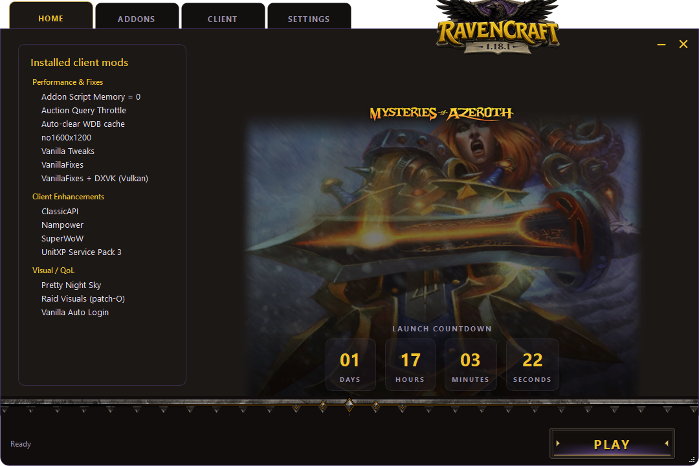
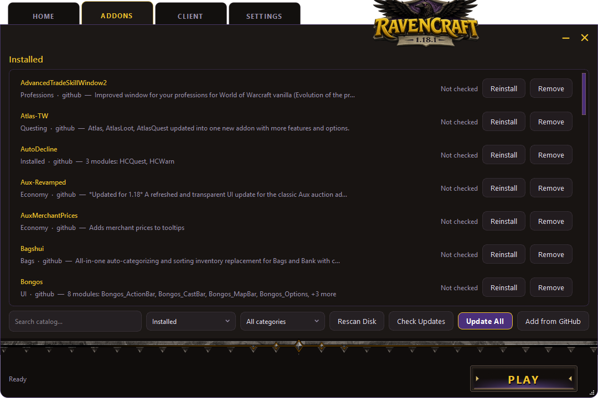
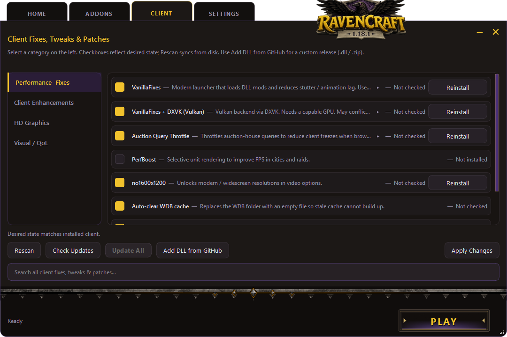
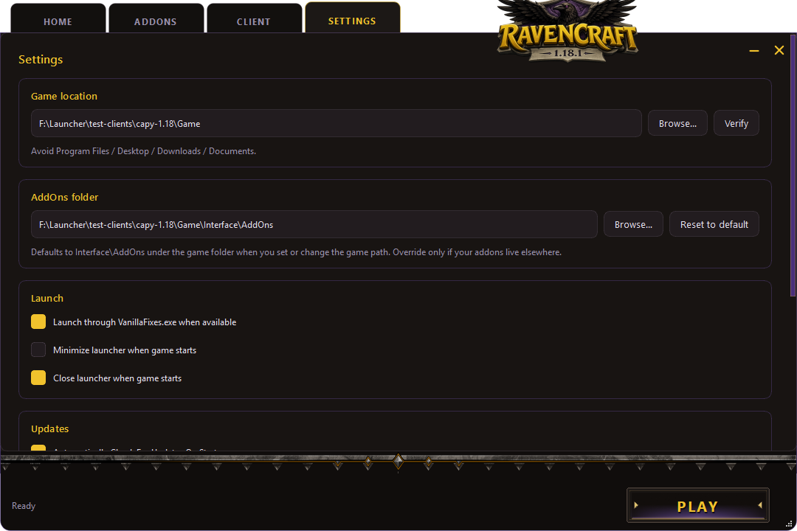

# IchaLaunch

[](https://buymeacoffee.com/jeb32411u)

**IchaLaunch** is the desktop launcher for **[RavenCraft](https://ravencraft.io/)** — a Turtle WoW–compatible 1.18 client experience. It installs and updates addons, manages client mods and visual packs, keeps itself up to date, and launches the game with one click.

Download the latest build from **[Releases](https://github.com/brutaliccus/IchaLaunch/releases/latest)**.

---

## Features

- **Play / Install** — point at an existing game folder (or pick where to install), then launch with the metallic **PLAY** button
- **Home** — RavenCraft branding, launch countdown, and a live list of installed client mods
- **Addons** — browse the Turtle WoW wiki catalog, search and filter, install or reinstall, and paste any GitHub addon repo
- **Client** — turn RetroCro / TurtleWoW-style fixes and Visual/QoL packs on or off (VanillaFixes, SuperWoW, Nampower, UnitXP, DXVK, night sky, and more), search across categories, then **Apply Changes**
- **Settings** — game folder plus a configurable **AddOns** path (defaults to `Interface\AddOns` under the game folder)
- **Updates** — quiet checks for addon and client-mod updates on launch (status in the bottom progress bar), plus a silent launcher self-update re-check every few minutes, with gold badges on tabs when something needs attention
- **Self-update** — when a newer IchaLaunch is available, **PLAY** becomes **UPDATE**
- **Backups** — copies of changed files live under `<your game>/.ichalaunch/backups/`

---

## Download & install

1. Open the latest release: [github.com/brutaliccus/IchaLaunch/releases/latest](https://github.com/brutaliccus/IchaLaunch/releases/latest)
2. Download **`IchaLaunch.exe`**
3. Put it somewhere convenient (next to your game folder is fine — not required)
4. Run the EXE

No installer is required. Windows may show a SmartScreen prompt for an unsigned download — choose **More info** → **Run anyway** if you trust the release.

---

## First run

1. Open **SETTINGS**
2. Click **Browse…** and select your Turtle / RavenCraft **game folder** (the folder that contains `WoW.exe`)
3. Prefer a simple path (for example `D:\Games\RavenCraft`). Avoid `Program Files`, Desktop, Downloads, and Documents when you can — Windows protections there often block client mods
4. Optional: open **CLIENT**, tick the mods you want, then **Apply Changes**
5. Optional: open **ADDONS**, install from the catalog or **Add from GitHub**
6. Click **PLAY** on the bottom bar

Official hosted client zip install is not required if you already have a 1.18 client — just point Settings at that folder.

---

## Screenshots

### Home



### Addons



### Client



### Settings



---

## Troubleshooting

**Windows Defender / Controlled Folder Access blocks VanillaFixes or DLL mods**  
Allow `IchaLaunch.exe`, `VanillaFixes.exe`, and `WoW.exe`, or move the game out of a protected folder. If a VanillaFixes zip extract fails with a strange path error, Defender is a common cause — retry after an allow-list, or reinstall VanillaFixes from the **CLIENT** tab.

**Addon / update checks fail or feel stuck**  
GitHub’s anonymous API limit is low. In **SETTINGS → GitHub API**, paste a personal access token (no special scopes needed for public repos). It only raises the local rate limit and stays on your PC.

**PLAY does nothing / “Client not found”**  
Confirm **SETTINGS** points at the folder that contains `WoW.exe`, then click **Verify**.

**Gold dots on ADDONS or CLIENT**  
Those tabs have pending updates or unapplied client changes — open the tab and update / apply.

More help and downloads: **[Releases](https://github.com/brutaliccus/IchaLaunch/releases)**.

---

<details>
<summary>For developers</summary>

```bat
cd F:\Launcher
python -m pip install -r requirements.txt
python run.py
```

Build the EXE:

```bat
python -m PyInstaller IchaLaunch.spec --noconfirm
```

Output: `dist\IchaLaunch.exe`

</details>
