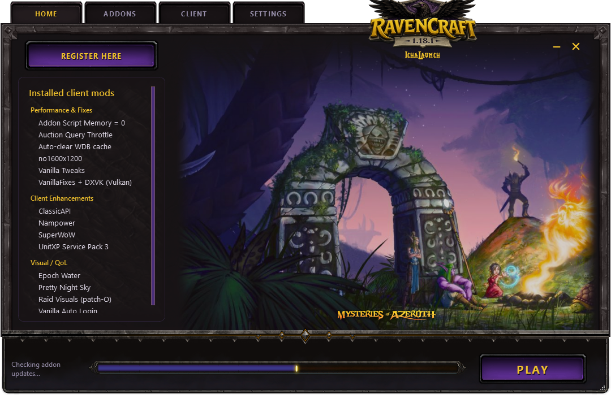

# IchaLaunch

[](https://buymeacoffee.com/jeb32411u)

**IchaLaunch** installs **[RavenCraft](https://ravencraft.io/)** (Turtle WoW–compatible 1.18), manages addons and client mods, and launches the game.

Download **`IchaLaunch.exe`** from **[Releases](https://github.com/brutaliccus/IchaLaunch/releases/latest)**.

A frameless RavenCraft-themed window: **HOME**, **ADDONS**, **CLIENT**, **SETTINGS**, and a **PLAY** bar.

---

## Get the launcher

1. Open the latest release: [github.com/brutaliccus/IchaLaunch/releases/latest](https://github.com/brutaliccus/IchaLaunch/releases/latest)
2. Download **`IchaLaunch.exe`**
3. Put it somewhere convenient (next to your game folder is fine — not required)
4. Run the EXE

No installer. Windows may show a SmartScreen prompt for an unsigned download — **More info** → **Run anyway** if you trust the release.

---

## Install the RavenCraft client


If you already have a 1.18 client, skip INSTALL and point **SETTINGS** at the folder that contains `WoW.exe`.

Otherwise tap **INSTALL** on the bottom bar:

1. Pick a parent folder (prefer something simple like `D:\Games` — avoid Program Files, Desktop, Downloads, and Documents)
2. Your browser opens **Gofile** — download **`twmoa_1181.zip`** (a VPN may be required)
3. Leave IchaLaunch open. It watches **Downloads**, extracts into a **`RavenCraft`** folder, writes `realmlist.wtf`, then deletes the zip
4. **PLAY** appears when the client is ready

To unlink and install again, use **Reset Client Link** in **SETTINGS**. That forgets the saved folder; it does not delete files on disk.

---

## Play

**PLAY** launches World of Warcraft. If VanillaFixes is installed, the launcher starts through `VanillaFixes.exe` (you can turn that off in Settings).

---

## Addons


- Browse the Turtle WoW wiki **catalog**, search, and filter
- **Install** from the catalog, or **Add from GitHub** (paste any public addon repo)
- **Preview** a repo’s README before you install
- **Update** / **Update All** when a newer version is available
- Uncheck an addon to **unload** it (it stays on disk, the game just won’t load it)

---

## Client mods


The **CLIENT** tab is for engine and visual packs — VanillaFixes, DXVK, SuperWoW, Nampower, UnitXP, night sky, and similar.

Tick what you want, then **Apply Changes**. Search across categories; **Open in Git** when a repo link exists.

---

## Settings


- **Game location** — folder that contains `WoW.exe`, plus **Verify**
- **AddOns folder** — defaults to `Interface\AddOns` under the game; override if yours lives elsewhere
- **Launch** — VanillaFixes, minimize or close the launcher when the game starts
- **Automatically Check For Updates On Startup** — launcher, addons, and client mods
- **GitHub API** — optional personal access token if anonymous checks hit GitHub’s rate limit (no special scopes; stays on your PC)
- **Reset Client Link** — unlink the saved WoW folder so **PLAY** becomes **INSTALL** again

---

## Progress and launcher updates



Downloads, extracts, and update checks show a **determinate** bar on the bottom strip (how far along, not a spinner).

When a newer IchaLaunch is on GitHub Releases, **PLAY** becomes **UPDATE**. That replaces the EXE in place — you do not re-download from the site by hand.

---

## Troubleshooting

**Windows Defender / Controlled Folder Access blocks VanillaFixes or DLL mods**  
Allow `IchaLaunch.exe`, `VanillaFixes.exe`, and `WoW.exe`, or move the game out of a protected folder.

**Addon / update checks fail or feel stuck**  
GitHub’s anonymous API limit is low. In **SETTINGS → GitHub API**, paste a personal access token.

**PLAY does nothing / “Client not found”**  
Confirm **SETTINGS** points at the folder that contains `WoW.exe`, then click **Verify**.

**Gold dots on ADDONS or CLIENT**  
Those tabs have pending updates or unapplied client changes — open the tab and update / apply.

More help: **[Releases](https://github.com/brutaliccus/IchaLaunch/releases)**.

---

<details>
<summary>Build from source</summary>

```bat
python -m pip install -r requirements.txt
python run.py
```

Build the EXE:

```bat
python -m PyInstaller IchaLaunch.spec --noconfirm
```

Output: `dist\IchaLaunch.exe`

</details>
